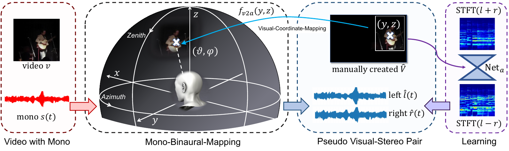
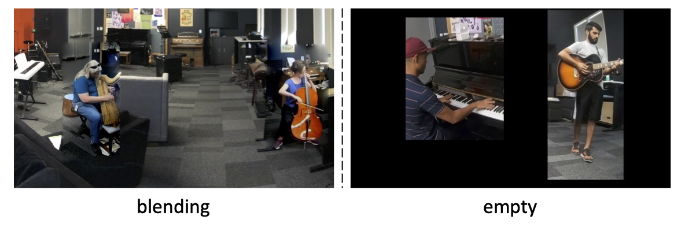

# Visually Informed Binaural Audio Generation without Binaural Audios (CVPR 2021)

[Xudong Xu*](https://sheldontsui.github.io/), [Hang Zhou*](https://hangz-nju-cuhk.github.io/), [Ziwei Liu](https://liuziwei7.github.io/), [Bo Dai](http://daibo.info/), [Xiaogang Wang](http://www.ee.cuhk.edu.hk/~xgwang/), and [Dahua Lin](http://dahua.me)

Stereophonic audio, especially binaural audio, plays an essential role in immersive viewing environments. Recent research has explored generating stereophonic audios guided by visual cues and multi-channel audio collections in a fully-supervised manner. However, due to the requirement of professional recording devices, existing datasets are limited in scale and variety, which impedes the generalization of supervised methods to real-world scenarios. In this work, we propose **PseudoBinaural**, an effective pipeline that is free of binaural recordings. The key insight is to carefully build pseudo visual-stereo pairs with mono data for training. Specifically, we leverage spherical harmonic decomposition and head-related impulse response (HRIR) to identify the relationship between the location of a sound source and the received binaural audio. Then in the visual modality, corresponding visual cues of the mono data are manually placed at sound source positions to form the pairs. Compared to fully-supervised paradigms, our binaural-recording-free pipeline shows great stability in the cross-dataset evaluation and comparable performance under subjective preference. Moreover, combined with binaural recorded data, our method is able to further boost the performance of binaural audio generation under supervised settings.

[[Project]](https://sheldontsui.github.io/projects/PseudoBinaural) [[Paper]](https://arxiv.org/abs/2104.06162) [[Demo]](https://youtu.be/r-uC2MyAWQc)



## Requirements
* Python 3.7 is used. Basic requirements are listed in the 'requirements.txt'
```
pip install -r requirements.txt 
```

## Dataset

**FAIR-Play** can be accessed [here](https://github.com/facebookresearch/FAIR-Play).
**MUSIC21** can be accessed [here](https://github.com/roudimit/MUSIC_dataset).
**YT-Music** can be accessed [here](https://github.com/pedro-morgado/spatialaudiogen).

## Training and Testing

All the training and testing bash scripts can be found in *'./scripts'*. For [**FAIR-Play**](https://github.com/facebookresearch/FAIR-Play) dataset, we create five non-overlapping splits in folder *'new_splits'* as illustrated in the paper. The model trained on the non-overlapping split1 can be found [here](https://drive.google.com/drive/folders/1F13jx4XV6mOI46yE8FXJNqHIi4U3W7Vm?usp=sharing).

We have tried two different schemes for creating the pseudo visual-stereo pairs. One method is padding the visual patches on a pre-defined background image and leveraging the Possion blending to refine the boundary. Another is to place the visual patches on an empty background. We found the performance of empty background scheme is slightly better than the blending one.


## License and Citation
The usage of this software is under [CC-BY-4.0](https://github.com/SheldonTsui/PseudoBinaural_CVPR2021/blob/master/LICENSE).
```
@inproceedings{xu2021visually,
  title={Visually Informed Binaural Audio Generation without Binaural Audios},
  author={Xu, Xudong and Zhou, Hang and Liu, Ziwei and Dai, Bo and Wang, Xiaogang and Lin, Dahua },
  booktitle={Proceedings of the IEEE conference on computer vision and pattern recognition (CVPR)},
  year={2021}
}
```

## Acknowledgement
The structure of this codebase is borrowed from [2.5D Visual Sound](https://github.com/facebookresearch/2.5D-Visual-Sound) and [SepStereo](https://github.com/SheldonTsui/SepStereo_ECCV2020).
